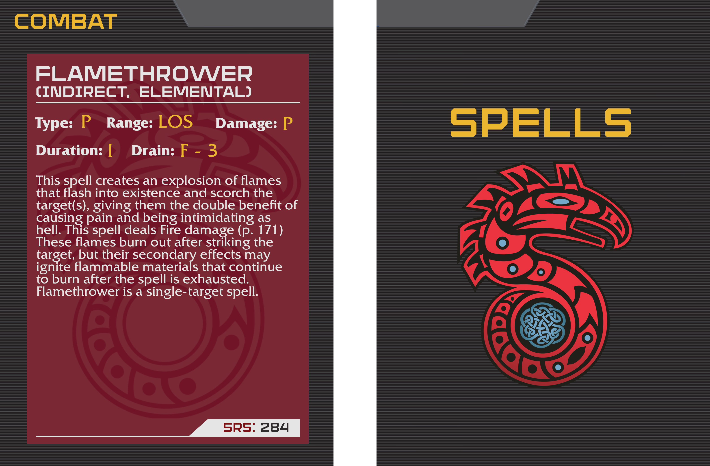

# Shadowrun 5e Spell Card Template

- The template is a pair of .xcf files (front and back) that may be edited in
[GIMP](https://www.gimp.org/).
- Each element is on its own layer to make it easier to hide/swap them out.
- Several background colors can be selected by via layers.
- The cards are 2.5x3.5in at 600ppi (suitable for high quality printing).

### Fonts

In order for this look right, you need to have the following fonts installed on
your system:

- [Armadura Solid](https://www.myfonts.com/fonts/graviton/armadura/)
- [Fritz Quadrata Std](https://www.onlinewebfonts.com/fonts/friz_quadrata) font
  family.

Note:  [Rexlia](https://www.dafont.com/rexlia.font) is a free font that is
visually similar to Armadura Solid, and should work; but you will have to
manually set it for the relevant elements.

### Logo

The logo is taken from [kisspng.com](https://www.kisspng.com/png-shadowrun-dragonfall-shadowrun-returns-logo-emblem-4020621/).

### Example

### License

[CC0](https://creativecommons.org/share-your-work/public-domain/cc0/)
